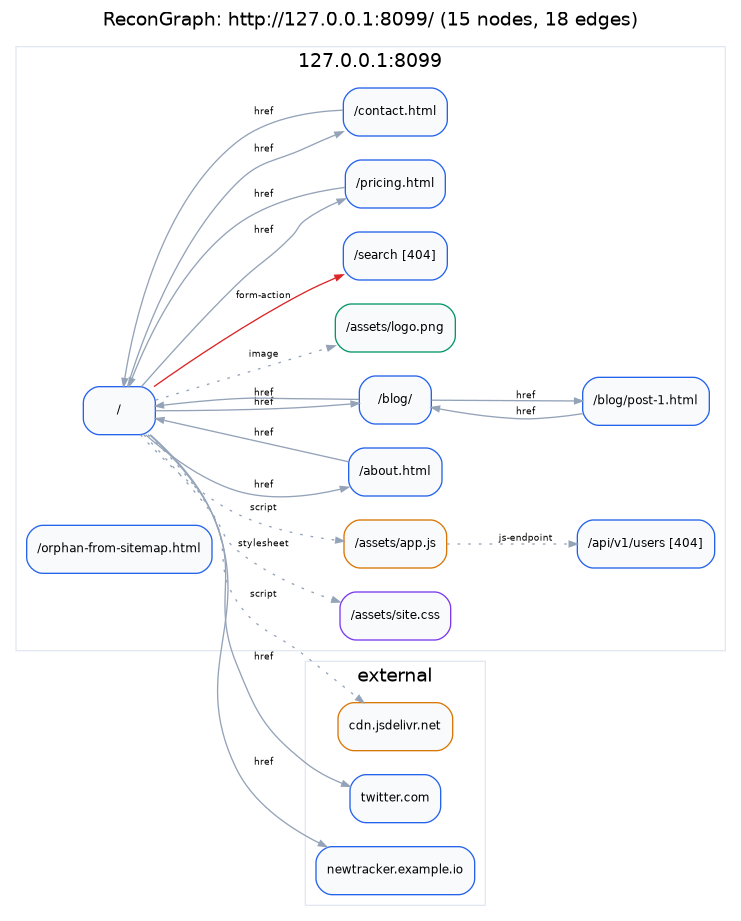

# ReconGraph

A web crawler that builds a directed graph of a site instead of printing a list of URLs, stores each crawl, and diffs them.



```sh
recongraph crawl -u https://example.com
recongraph query latest --orphans
recongraph diff latest~1 latest
```

Written in Go. One third-party dependency (`golang.org/x/net/html`), static binary, no cgo.

## What it's for

I started this after reading through [hakrawler](https://github.com/hakluke/hakrawler) and noticing that it, gospider and katana all share an output model: a stream of URLs you grep once and throw away. That's fine for feeding the next tool in a pipeline, but it loses the structure: which page links to which, what's referenced only from a script, what changed since last week.

So the crawl here is a means to an end. What you get at the end is a graph you can query:

- which pages are hubs (ranked by inbound links) and which are orphans (nothing anchors to them)
- how many clicks a given path is from the front door
- every third-party host the site loads script from
- what appeared, disappeared or moved since the last crawl

## Install

```sh
go install github.com/swapnil5053/recongraph/cmd/recongraph@latest
```

From source (Go 1.24+):

```sh
git clone https://github.com/swapnil5053/recongraph
cd recongraph
make build        # ./bin/recongraph
```

No `make` (e.g. plain Windows):

```powershell
go build -o recongraph.exe ./cmd/recongraph
.\recongraph.exe version
```

### Trying it without a target

You need a site you're allowed to crawl. The quickest one is your own machine:

```sh
cd some/folder/with/html
python -m http.server 8000
# in another terminal
recongraph crawl -u http://127.0.0.1:8000/ --rate 20
recongraph query latest
```

Crawls are saved to `~/.recongraph/crawls` (`%USERPROFILE%\.recongraph\crawls`
on Windows). Set `RECONGRAPH_HOME` or pass `--store` to put them elsewhere.
Graphviz is only needed for `-f svg`.

## Usage

### crawl

```sh
# URLs on stdout, graph saved to ~/.recongraph/crawls
recongraph crawl -u https://example.com

# reads stdin too, so it still drops into a pipeline
cat hosts.txt | recongraph crawl | httpx

# subdomains in scope, depth 4, interactive report
recongraph crawl -u https://example.com --subs -d 4 -o map.html -f html

# slow it right down for a production target
recongraph crawl -u https://example.com --rate 0.5 --burst 1 -c 4

# authenticated, restricted to one section
recongraph crawl -u https://example.com/app/ \
  -H "Cookie: session=abc" --path /app --exclude '/logout'
```

Output formats: `urls` (default), `json`, `adjacency`, `dot`, `svg`, `csv`, `html`.

`svg` shells out to Graphviz if you have it. `html` is a single self-contained
file with a force-directed view and no CDN references, which is usually more
useful.

### query

```sh
recongraph query latest                    # summary
recongraph query latest --orphans
recongraph query latest --hubs 20
recongraph query latest --external         # third-party hosts by reference count
recongraph query latest --path-to /admin
recongraph query latest --links-to /login
recongraph query latest --components       # separate apps sharing one host
recongraph query latest --tech wordpress
recongraph query latest --findings secret-like
recongraph query latest --status 403
```

`latest` also works as `latest~1`, `latest:example.com`, a full crawl ID, or any
unique prefix of one.

### diff

```sh
recongraph list
recongraph diff latest~1 latest
recongraph diff latest~1 latest --json --ignore-content
```

Output is grouped into appeared, disappeared, changed (status, content hash,
title or detected stack), restructured, third-party hosts, and findings.

"Restructured" is the one that needed the graph: same page, same status code,
different outbound references. A checkout page that quietly started loading a
script from a host that wasn't there last month shows up here and nowhere else.

### fingerprint

```sh
recongraph fingerprint https://example.com
recongraph fingerprint --list
```

64 signatures, embedded at build time. During a crawl this runs inline and
attaches per node rather than per site, because a marketing page behind a CDN
and a Django admin on the same host don't run the same stack.

Signatures declare optional probe paths (`/wp-admin/`, `/.git/HEAD`). Those are
requests to URLs nothing linked to, so they're off unless you ask for them.

## How it works

```
                    ┌──────────────────────────────────────────┐
   seeds ──────────▶│           FRONTIER (1 goroutine)         │
                    │   priority queue · visited set           │
                    │   depth · in-flight counter              │
                    └───┬──────────────────────────────▲───────┘
                        │ ready (bounded)              │ candidates (bounded)
                        ▼                              │
        ┌───────────────────────────────────┐          │
        │         WORKER POOL (N)           │          │
        │  fetch → parse → passive →        │          │
        │  fingerprint                      │          │
        └───────────────┬───────────────────┘          │
                        │ results (bounded)            │
                        ▼                              │
        ┌───────────────────────────────────┐          │
        │      GRAPH BUILDER (1 goroutine)  │──────────┘
        │  sole owner of the graph          │
        └───────────────────────────────────┘
```

The builder goroutine is the only writer to the graph, so there's no mutex on it
and scope gets applied in exactly one place.

The pipeline is a cycle and every leg is a bounded channel, which is a deadlock
waiting to happen: the frontier parks on a send to the workers while the builder
parks on a send back to the frontier. The fix is that the frontier's main loop
offers both operations in the same `select`, with a nil channel disabling the
send arm when the queue is empty, so it always drains. `internal/frontier`.

Termination is an in-flight counter rather than a `WaitGroup`, because a crawl
generates its own work and there's no total to wait on.

Backpressure is just the bounded channels. A slow builder fills the result
channel, workers block on send, they stop pulling tasks, the frontier backs up.

More detail in [docs/adr/](docs/adr/).

## Site

`site/index.html` is the project page: one static file, no build step. `.github/workflows/pages.yml` deploys it to GitHub Pages on any push that touches `site/`. Turn Pages on in the repo settings with the source set to GitHub Actions.

## Layout

```
cmd/recongraph/   entry point
internal/
  cli/            subcommands
  scope/          what's in bounds
  frontier/       queue, dedup, termination
  fetch/          HTTP client, per-host limiter, retries, robots.txt
  parse/          HTML and sitemap extraction, no I/O
  passive/        emails, buckets, endpoints, secrets, internal hosts
  fingerprint/    signature engine + embedded database
  builder/        graph construction
  crawl/          pipeline wiring
  store/          persistence
  diff/           crawl comparison
  export/         json, dot, csv, html, svg
pkg/sitegraph/    the graph model, canonical URLs, encoders
site/             project page (GitHub Pages)
```

Only `sitegraph` is in `pkg/`, since it's the one thing you'd import to read
ReconGraph output without wanting the crawler.

## Defaults

- **robots.txt is respected.** Most tools here default the other way. There's an
  `--ignore-robots` flag for work you're authorised to do, and it warns.
- 2 requests/second per host, burst 4, with jitter. A host that answers 429 or
  503 gets its rate halved for the rest of the crawl.
- `--max-pages 2000`. If a budget truncates a crawl the summary says so and the
  stored status is `budget-exceeded`.
- Ctrl-C keeps the partial graph and tags it `interrupted`.

## Limitations

- **No headless rendering.** A JavaScript-heavy SPA will return almost nothing.
  [katana](https://github.com/projectdiscovery/katana) does this properly and
  will out-crawl ReconGraph on modern front-ends.
- **JS endpoint extraction is regex-based**, not real parsing. It gets string
  literals and obvious `fetch()` calls and misses anything computed.
- **No passive sources.** Nothing from Wayback, Common Crawl or certificate
  transparency; only what's reachable by crawling.
- `RootDomain` doesn't know about multi-part public suffixes (`foo.co.uk`). It's
  only used for display; scope checks compare host labels exactly.
- The whole graph loads into memory. Fine at the 2k-page default, not designed
  for 500k.

## Development

```sh
make test         # go test ./...
make test-race    # go test -race ./...
make cover
make lint         # gofmt + go vet
make release      # static binaries for five platforms in dist/
```

The heaviest tests are on URL canonicalisation (`pkg/sitegraph/canonical.go`),
because diff quality depends on it almost entirely: normalise too little and
every crawl looks 100% changed, too much and real changes vanish.
`internal/cli/cli_test.go` runs the real binary's code path end to end against
a two-version test server: crawl, crawl again, then list, query, diff and export.

## Prior art

The two ideas kept from [hakrawler](https://github.com/hakluke/hakrawler) are
the shape of the crawl loop and reading seeds from stdin, which is why `urls` is
still the default output format.

No hakrawler code is used. I read it, wrote up what I found in
[docs/AUDIT-hakrawler.md](docs/AUDIT-hakrawler.md), and started an empty module.
It's 231 lines of logic in one file, so there wasn't much to inherit even if I
had wanted to fork it. The audit also covers four bugs in the original,
including a `-subs` scope filter that accepts `example.com.attacker.net` as
in-scope; `TestSameOrSubdomainRejectsScopeEscape` is the regression test for
that class.

[gospider](https://github.com/jaeles-project/gospider) is where the idea of
treating sitemap.xml and robots.txt as discovery sources rather than only
restrictions came from. katana's per-host rate limiting and scope field design
are both better than my first attempt at either.

## Legal

Only point this at systems you own or are authorised to test. The defaults are
conservative because it generates real traffic against real infrastructure.

## Licence

MIT. See [LICENSE](LICENSE).
